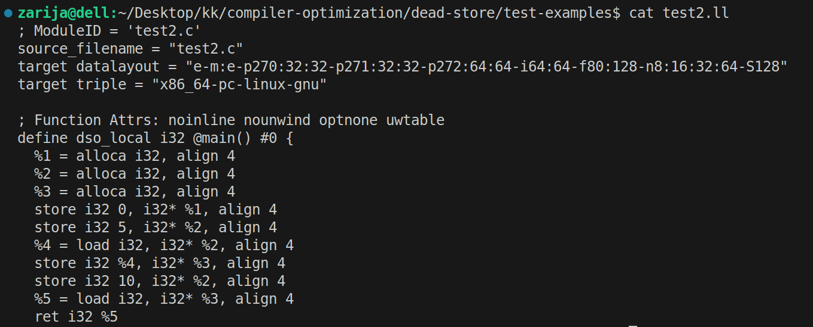
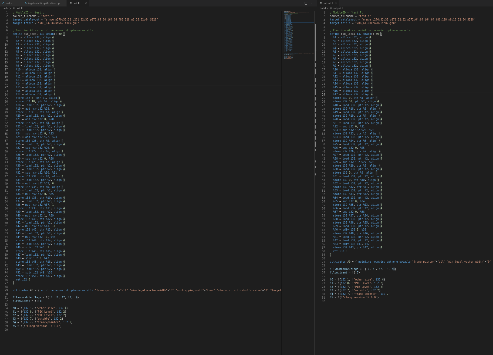

# Compiler Optimization Project

Projekat iz kursa **Konstrukcija Kompilatora** na Matematičkom Fakultetu u Beogradu

## Tim
- **Zarija Trtović** - Dead Store Elimination
- **Mima Grujić** - Algebraic Simplification


## Struktura projekta
```
compiler-optimization/
│
├── README.md                          # Ovaj fajl
├── .gitignore                         # Git ignore pravila
│
├── dead-store/                        # Dead Store Elimination (Zarija)
│   ├── DeadStoreElimination.cpp      # Glavni kod
│   └── test-examples/                 # Test primeri
│
└── algebraic-simplification/          # Algebraic Simplification (Mima)
    ├── AlgebraicSimplification.cpp   # Glavni kod
    └── test-examples/                 # Test primeri


Dead-store - Opis:
Optimizacija koja detektuje i uklanja "dead stores" - dodele vrednosti promenljivama koje se nikada ne koriste nakon dodele.

Dead store nastaje kada se:
1. Vrednost dodeli promenljivoj, ali se odmah prepiše pre korišćenja
2. Vrednost dodeli promenljivoj koja se nikad ne koristi

Algoritam

1. Učitaj LLVM IR fajl
2. Za svaku store instrukciju, traži sledeću instrukciju sa istom adresom:
   - Ako je sledeća store → prva je DEAD
   - Ako je sledeća load → prva je LIVE
   - Ako nema ni jednog → DEAD
3. Generiši optimizovani fajl bez dead stores
```
### LLVM IR pre optimizacije 


### LLVM IR posle optimizacije


```
Algebraic Simplification:
Optimizacija pojednostavljuje trivijalne aritmeticke izraze u LLVM IR kodu, smanjujuci nepotrebne operacije.
	
Algoritam

1. Prolaskom kroz svaki Basic Block i instrukciju unutar njega utvrdjuje se da li se unutar nje primenjuje binarna operacija.
	- Ukoliko se primenjuje, utvrdjuje se koja - sabiranje, oduzimanje, mnozenje ili deljenje.
	- Ukoliko se ne primenjue, algoritam prelazi na sledecu instrukciju.
2. U zavisnosti od operacije, vrsi se zamena izraza jednim operandom ili konstantom na sledeci nacin:
	1. x + 0 --> x
	2. 0 + x --> x
	3. x - 0 --> x
	4. 0 - x --> -x
	5. x - x --> 0
	6. x * 0 --> 0
	7. 0 * x --> 0
	8. x * 1 --> x
	9. 1 * x --> x
	10. x * (-1) --> -x
	11. (-1) * x --> -x
	12. x / 1 --> x
	13. 0 / x --> 0 (x != 0)
	14. x / x --> 1 (x != 0)
	15. x + (-x) --> 0
3. Generise se optimizovani fajl sa uproscenim izrazima.

```

### LLVM IR pre i posle optimizacije

	
```
Potrebni alati
- LLVM 14+
- Clang
- g++ ili clang++
```
